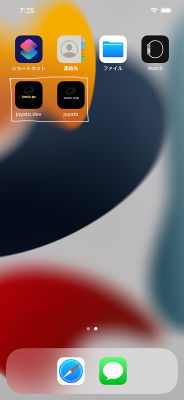
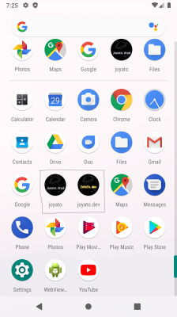

# 常夜灯

## 場所に思いを刻む SNS

このプロジェクトは Flutter 大学の第９期共同開発のひとつとして立ち上がりました。

コンセプトは『場所に思いを刻む SNS』です。

Twitter や Facebook, Instagram では時間に対して投稿を行います。投稿データはタイムライン上に流れていき、日付をまたげばまったく新しい投稿たちが並ぶでしょう。常夜灯はそんな SNS のカウンターとして企画されました。

常夜灯では場所に対して投稿を行います。自分が今いる場所にのみ投稿することができます。その投稿データは場所に刻まれるで時間が経過しても、その場所で存在感を発揮し続けるでしょう。

第三者はその場所に出向かなければ投稿の内容を読むことはできません。そこにたどりついた人たちだけが、その投稿を読むことができます。ちょうど旅先の宿帳で 1 ヶ月前、1 年前、10 年前の書き込みを目にしたときのような、時間を超えたつながりを体験するアプリが作りたいと思っています。

## ビルドまでの手順

新しくチームに参加された方にビルドまでの手順を説明します。
本プロジェクトでは dev と prod の 2 つの開発環境を用意しています。
それら 2 つの環境で iOS と Android のビルドができる状態にし、下記の画像のような状態を目指しましょう。

- dev アプリ名: joyato.dev
- prod アプリ名: joyato


_iOS_

_android_  
 <br>

## Firebase 設定ファイルの適用

Firebase の設定ファイルをダウンロードするために joyato-dev と joyato-prod プロジェクトに参加する必要があります。

- [joyato-dev](https://console.firebase.google.com/project/joyato-dev/overview?hl=ja)
- [joyato-prod](https://console.firebase.google.com/project/joyato-prod/overview?hl=ja)  
  <br>

上記の 2 つのプロジェクトの閲覧権限がない場合はこんぶさんに DM しプロジェクトに招待してもらいましょう。  
<br>

### _1 firebase の設定ファイル android と iOS それぞれダウンロードしフォルダに格納する_

---

<br>

1. firebase コンソールに移動し joyato-dev と joyato-prod のプロジェクトがあるか確認してください。
2. 確認ができましたら dev と prod どちらからでも良いのでプロジェクトを開いてください。

<br>

    ※今回の説明ではdevを使用します。

<br>

3. プロジェクトを開けたら左上に歯車のアイコンがあると思うのでそこを押しプロジェクトの設定を選択してください。選択したら下の方にマイアプリという欄があると思うので Android アプリを選択し google-services.json をダウンロードしてください。iOS の場合は Apple アプリの GoogleService-Info.plist をダウンロード。  
   <br>

- 詳しくは下記を読んでください！
- https://support.google.com/firebase/answer/7015592?hl=ja#zippy=%2C%E3%81%93%E3%81%AE%E8%A8%98%E4%BA%8B%E3%81%AE%E5%86%85%E5%AE%B9  
  <br>

4. ダウンロードできたら android 配下にある dev フォルダに google-services.json を入れてください。  
   <br>

- iOS の場合は GoogleService-Info.plist をダウンロードし iOS 配下にある dev フォルダに GoogleService-Info.plist を入れる。

  - android/dev/google-service.json
  - android/prod/google-service.json
  - ios/dev/GoogleService-Info.plist
  - ios/prod/GoogleService-Info.plist  
    <br>

  上記のようになっていれば OK です！同じ作業を joyato-prod プロジェクトでも行います。  
  <br>

- android も iOS をやり方は共通です!
  - android の dev と prod フォルダには google-services.json
  - iOS の dev と prod フォルダには GoogleService-Info.plist  
    <br>

### _2 dev と prod のビルドのやり方_

---

<br>

1. シュミレーターを開きターミナルで以下のコマンドを打ちます。

- dev: flutter run --dart-define=FLAVOR=dev
- dev: flutter run --dart-define=FLAVOR=prod  
  <br>

それぞれビルドできたらアイコンとアプリ名が変わっていると思われます。
android も iOS も共通のコマンドとやり方です。

---

## API-KEY 設定

1. project 配下に「map_api_key.env」という名前でファイルを生成してください。
2. 生成したファイルに`MAP_API_KEY=使用するAPI-KEY`の形式で記載してください。
   
3. 次に/android/app/src/main/res/values/の配下に「keys.xml」という名前でファイルを生成してください。
4. 下記の<string...string>の間に使用する API-KEY を記載してください。

```
<?xml version="1.0" encoding="utf-8"?>
<resources>
    <string name="google_maps_key" translatable="false"    templateMergeStrategy="preserve">

    </string>
</resources>
```


※iOS の読み込みが不具合の場合、[こちらの記事](https://www.rect-angle.com/tech/flutter/flutter-env/)を参照しビルドスクリプトが正しく動作しているかを確認してください。

※Android の読み込みが不具合の場合、[こちらの記事](https://medium.com/@ykaito21/flutter-from-zero-to-one-how-to-ignore-google-map-api-key-from-source-control-18e119ff5a47)を参照し、keys.xml が生成されているか確認してください。
